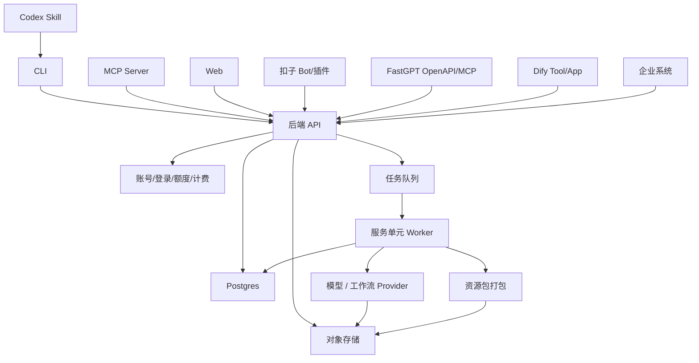

# AI-native 垂直能力服务平台

## 核心判断

本项目不是传统网页工具，也不是某一个单点 AI 功能。

它的核心是：把高价值垂直任务包装成可被智能体、CLI、MCP、工作流平台、Web 和企业 API 调用的服务单元。

核心链路：

```text
高价值垂直任务
-> 标准输入
-> 标准输出
-> 后端生产服务
-> 账号与额度
-> 多渠道发布
-> 标准资源包交付
```

传统软件主要靠网页渠道：

```text
人
-> 打开网页
-> 学习 UI
-> 操作工具
-> 下载结果
```

AI-native 产品会增加智能体渠道：

```text
人
-> 告诉智能体目标
-> 智能体调用 Skill / MCP / CLI / API / 扣子 / Dify / FastGPT
-> 后端服务生产结果
-> 智能体把结果交还给人
```

网页不会消失，但网页从唯一入口变成众多入口之一。后端生产能力、账号额度、任务系统、成本核算和标准资源包才是产品核心。

## 产品定位

一句话定位：

> 可被智能体调用的 AI 垂直能力服务平台。

第一阶段不做通用能力市场，也不直接做大而全 SaaS。先选择一个具体服务单元验证平台方法。

平台要验证的是：

1. 一个垂直能力能否被标准化成服务单元。
2. 一个服务单元能否通过多渠道稳定调用。
3. 用户是否愿意用账号和额度消费服务结果。
4. 调用、成本、失败、重试、交付是否能被统一管理。

## 服务单元规范

每个能力都按“服务单元”设计。

一个服务单元必须定义：

1. 用户输入什么。
2. 服务产出什么。
3. 产出物能拿去做什么。
4. 消耗多少额度。
5. 如何验收质量。
6. 失败如何重试。
7. 可以通过哪些渠道调用。

服务单元的标准描述：

```text
service_id:
name:
target_user:
input_schema:
output_schema:
credit_rule:
quality_check:
retry_policy:
channels:
package_manifest:
```

第一批候选服务单元：

| 服务单元 | 输入 | 输出 | 目标用户 |
|---|---|---|---|
| `dreamina_cli_pool` | 官方 Dreamina CLI 命令 | 多账号调度、任务绑定、结果包 | AI 创作者、内部交付团队 |
| `story_to_pack` | 小说/剧本文本 | 分镜表、角色卡、场景卡、关键帧、粗剪、资源包 | 漫剧/短剧团队 |
| `script_to_storyboard` | 剧本/文本片段 | 分镜表、镜头任务、prompt | 编剧、AI 操作员 |
| `character_to_reference_pack` | 角色描述/参考图 | 角色卡、多角度图、参考图、prompt | AI 绘图师、制作团队 |
| `shot_to_keyframe` | 镜头描述/角色图 | 镜头关键帧、图片 prompt | AI 视频创作者 |
| `keyframes_to_rough_cut` | 关键帧、字幕、时长 | 粗剪 MP4、项目 JSON | 剪辑、制片 |
| `hot_content_breakdown` | 爆款视频/剧本/链接 | 节奏表、爽点、钩子、结构拆解 | 编剧、策划、MCN |
| `ip_adaptation_eval` | 小说/IP 片段 | 改编潜力、风险、受众、成本估计 | IP 方、制片 |
| `proposal_pack` | 故事、角色图、分镜 | Markdown/PPT 提案、粗剪 Demo | 商务、IP 方 |
| `workflow_pack` | 分镜表/资产 | ComfyUI workflow、批量 prompt、任务清单 | AI 操作员 |

第一个技术闭环见：[dreamina_cli_pool：Dreamina CLI 多账号池封装](examples/dreamina-cli-pool.md)。

第一个业务闭环见：[story_to_pack：小说/剧本到 AI 漫剧前期制作包](examples/story-to-pack.md)。

## 渠道模型

渠道分成五类：

| 渠道类型 | 面向对象 | 主要作用 |
|---|---|---|
| 网页渠道 | 人 | 建立信任、展示案例、注册、支付、提交试跑、下载结果 |
| 智能体渠道 | Agent | 发现能力、理解参数、调用工具、检查产出、处理失败 |
| 工作流渠道 | Dify/FastGPT/扣子等平台 | 把能力嵌入用户已有流程 |
| 系统渠道 | 企业系统/API | 批量调用、私有化集成、自动化生产 |
| CLI 渠道 | 技术用户/内部交付团队 | 稳定执行、批处理、调试和交付 |

发布渠道矩阵：

| 渠道 | 类型 | 作用 | 优先级 |
|---|---|---|---|
| 后端 API | 系统渠道 | 核心生产服务，负责账号、额度、任务、资产和打包 | P0 |
| CLI | CLI 渠道 | 稳定执行入口，适合内部交付、技术型客户和批处理 | P0 |
| Codex Skill | 智能体渠道 | 让 Codex 用户和内部智能体知道如何调用 CLI/API 并验收结果 | P1 |
| MCP Server | 智能体渠道 | 跨智能体调用协议，后续接 ChatGPT、Claude、Cursor、VS Code 等 | P1 |
| Dify Tool / Workflow | 工作流渠道 | 文本拆解工作流或外部工具入口 | P1 |
| FastGPT OpenAPI / MCP | 工作流渠道 | 企业私有化、知识库和工作流入口 | P2 |
| 扣子 Bot / 插件 | 工作流渠道 | 国内普通用户 Bot 入口和演示获客入口 | P2 |
| 极简 Web | 网页渠道 | 案例展示、注册、提交试跑、下载结果 | P2 |
| 企业开放 API | 系统渠道 | 给制作公司、平台方接入内部系统 | P3 |

所有渠道都调用后端 API。渠道不能直接管理模型密钥、任务状态、资源包或扣费逻辑。

推荐链路：

```text
Codex Skill / MCP / CLI / 扣子 / Dify / FastGPT / Web
-> 后端 API
-> 鉴权和额度
-> 任务队列
-> 模型与工作流
-> 标准资源包
```

不推荐链路：

```text
扣子 -> Dify -> FastGPT -> ComfyUI -> Remotion -> 文件
```

原因是状态、额度、失败重试、资产回写和成本核算都会分散，难以产品化。

## 技术架构



推荐 MVP 技术栈：

```text
CLI：Node.js + TypeScript，全局 npm 安装
本地存储：SQLite 起步，后续迁移 Postgres
任务执行：Node child_process
账号池：每个 Dreamina 账号独立 HOME
锁：账号目录文件锁
被封装工具：官方 dreamina CLI
后端 API：有多人/客户服务需求后再拆 Node.js + TypeScript 服务
MCP：后续暴露 Remote MCP Server
Web：后续只做展示、注册、提交试跑和下载结果
```

## 核心对象

```text
users
api_tokens
service_units
projects
source_documents
assets
generation_tasks
packages
credit_records
channel_invocations
```

关键设计：

1. `service_units` 定义每个能力的输入、输出、额度、验收和渠道。
2. `channel_invocations` 记录来自 CLI、Skill、MCP、Web、扣子、Dify、FastGPT、API 的调用。
3. `packages` 保存标准资源包和 `manifest.json`。
4. `generation_tasks` 统一管理排队、执行、失败、重试和扣费。
5. `api_tokens` 只保存用户级 token，不保存供应商模型密钥。

## Dreamina 增强封装协议

第一阶段 `ainong` 不是另起一套创作命令，而是对官方 `dreamina` CLI 做增强封装。

官方 `dreamina` 的安装方式：

```bash
curl -fsSL https://jimeng.jianying.com/cli | bash
```

`ainong` 的安装方式：

```bash
npm install -g ainong
```

`ainong` 应尽量兼容原 `dreamina` 的使用心智。用户不需要理解 `ainong dreamina ...` 这种二级命令；`ainong` 就是带账号池能力的 Dreamina 增强入口。

建议命令：

```bash
ainong login
ainong accounts
ainong text2video --prompt "古风少女，月下庭院"
ainong image2video --image ./input.png --prompt "镜头缓慢推进"
ainong frames2video --first ./first.png --last ./last.png --prompt "角色转身"
ainong status <task_id>
ainong export <task_id> --format zip
ainong check <package.zip>
```

`ainong` 增加的能力：

- 多账号登录。
- 使用 Dreamina 登录后的用户唯一标识作为账号 ID。
- 每个账号独立 `HOME`。
- 自动选择可用账号。
- 单账号文件锁，避免同一登录态并发冲突。
- 任务和账号绑定，查询结果时回到原账号。
- 结果打包为标准 `package.zip`。

CLI 不负责：

- 内置供应商模型 token。
- 绕过官方 `dreamina` 登录态。
- 伪造或共享用户登录凭据。

## Skill / MCP 协议

Skill 负责告诉智能体：

- 服务能做什么。
- 需要什么输入。
- 如何登录。
- 如何调用 CLI 或 API。
- 如何检查资源包是否完整。
- 失败时如何重试。

MCP 暴露标准工具：

```text
list_service_units
create_job
get_job_status
export_package
check_package
```

## 30 天平台验证计划

### 第 1 周：Dreamina CLI 账号池

- 确认官方 `dreamina` 安装流程。
- 定义 `accounts`、`tasks`、`login_sessions`。
- 实现 provider user id 作为账号 ID。
- 实现独立 HOME。
- 实现账号文件锁。
- 定义 `manifest.json`。

### 第 2 周：Node CLI 本地号池

- `npm install -g ainong`。
- `ainong login`。
- `ainong accounts`。
- `ainong text2video`。
- `ainong status`。
- `ainong export`。

### 第 3 周：真实生成与打包

- 调官方 `dreamina` CLI。
- 自动选择账号。
- 任务绑定账号。
- 查询结果使用原账号。
- 打包 `package.zip`。
- 记录成本、失败率和重试。

### 第 4 周：Agent 渠道验证

- Codex Skill。
- MCP Server。
- 让 Agent 调 `ainong` 完成登录、生成、查询、导出。
- 找 5 个真实生成任务试跑。

30 天验证标准：

```text
5 个真实生成任务
2 个愿意付费或继续合作的客户
1 个能被 CLI/Skill/MCP 稳定调用的 Dreamina 账号池封装
1 套可复用的资源包协议
```

## 待验证问题

1. `ainong` 是否完全兼容原 `dreamina` 参数，还是只封装高频命令？
2. 登录后可稳定获取的 Dreamina 用户唯一标识字段是什么？
3. 账号池并发策略是单账号严格串行，还是允许按命令类型放宽？
4. 免费额度按生成次数、账号数、任务时长还是资源包次数限制？
5. 第一批发布渠道优先做 Codex Skill 还是 MCP？
6. `dreamina_cli_pool` 跑通后，第二个业务服务单元是否做 `story_to_pack`？

## 参考

- Model Context Protocol：`https://modelcontextprotocol.io`
- Codex Skills：`https://developers.openai.com/codex/skills`
- Dify：`https://github.com/langgenius/dify`
- FastGPT：`https://github.com/labring/FastGPT`
- Coze：`https://www.coze.com`
- Dreamina CLI install：`https://jimeng.jianying.com/ai-tool/install`
