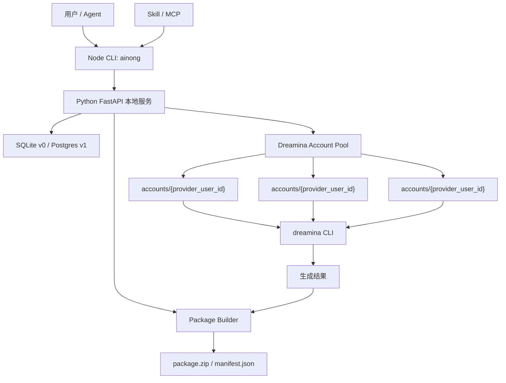

# dreamina_cli_pool：Dreamina CLI 多账号池封装

## 场景定位

`dreamina_cli_pool` 是 AI-native 垂直能力服务平台的第一个技术闭环。

它不是重新做一个图片或视频模型，而是封装官方 `dreamina` CLI，在原有能力基础上增加账号池：

```text
官方 dreamina CLI
-> 多账号登录
-> 账号 HOME 隔离
-> 自动选择可用账号
-> 单账号文件锁
-> 任务和账号绑定
-> 标准结果包
```

## 安装方式

官方 `dreamina` CLI 仍然按即梦官方方式安装：

```bash
curl -fsSL https://jimeng.jianying.com/cli | bash
```

`ainong` 通过 npm 全局安装：

```bash
npm install -g ainong
```

`ainong` 不替代官方安装脚本。它要求本机已有可用的 `dreamina` 命令，然后在其上增加账号池、调度和打包能力。

## 命令口径

用户不应该使用：

```bash
ainong dreamina ...
```

`ainong` 本身就是对原 `dreamina` 的增强封装，命令应尽量贴近官方命令：

```bash
ainong login
ainong accounts
ainong text2video --prompt "古风少女，月下庭院"
ainong image2video --image ./input.png --prompt "镜头缓慢推进"
ainong frames2video --first ./first.png --last ./last.png --prompt "角色转身"
ainong status <task_id>
ainong export <task_id> --format zip
ainong check <package.zip>
```

## 最小端到端流程

### 1. 安装官方 dreamina

```bash
curl -fsSL https://jimeng.jianying.com/cli | bash
dreamina --help
```

### 2. 安装 ainong

```bash
npm install -g ainong
ainong --help
```

### 3. 登录第一个账号

```bash
ainong login
```

内部流程：

```text
创建 login session
-> 创建临时 HOME
-> HOME=<temp_home> dreamina login
-> 用户扫码或授权
-> 读取 provider_user_id
-> 移动 HOME 到 accounts/{provider_user_id}
-> 写入 accounts 表
```

### 4. 登录更多账号

```bash
ainong login
ainong login
ainong accounts
```

`ainong accounts` 应展示：

```text
provider_user_id
status
last_used_at
last_error
credit_snapshot
```

### 5. 发起真实生成

```bash
ainong text2video --prompt "古风少女，月下庭院"
```

内部流程：

```text
查找 active 账号
-> 按 last_used_at 排序
-> 获取账号锁
-> HOME=accounts/{provider_user_id} dreamina text2video ...
-> 解析 provider task id
-> 记录 task_id -> provider_user_id
-> 释放账号锁
```

### 6. 查询任务

```bash
ainong status <task_id>
```

内部流程：

```text
根据 task_id 找 provider_user_id
-> HOME=accounts/{provider_user_id} dreamina 查询任务
-> 更新任务状态
```

### 7. 导出结果包

```bash
ainong export <task_id> --format zip
ainong check package.zip
```

输出：

```text
package.zip
├── manifest.json
├── stdout.txt
├── stderr.txt
├── result.json
└── assets/
```

## 账号 ID

不要使用 `account-001` 作为正式账号 ID。

登录成功后应读取 Dreamina 返回的用户唯一标识，并把它作为账号 ID：

```text
provider_user_id
```

目录结构：

```text
~/.ainong/dreamina/accounts/{provider_user_id}/
```

如果登录前还不知道 `provider_user_id`，可以先使用临时目录：

```text
~/.ainong/dreamina/login_sessions/{session_id}/
```

登录成功后：

```text
读取 provider_user_id
-> 检查是否已存在
-> 移动 HOME 到 accounts/{provider_user_id}
-> 注册账号池
```

## 技术架构



## 核心表

```sql
accounts (
  id TEXT PRIMARY KEY,
  provider_user_id TEXT UNIQUE NOT NULL,
  display_name TEXT,
  home_dir TEXT NOT NULL,
  status TEXT NOT NULL,
  last_used_at TEXT,
  last_alive_at TEXT,
  credit_snapshot_json TEXT,
  last_error TEXT,
  created_at TEXT,
  updated_at TEXT
);

tasks (
  id TEXT PRIMARY KEY,
  provider_task_id TEXT,
  account_id TEXT NOT NULL,
  command TEXT NOT NULL,
  args_json TEXT NOT NULL,
  status TEXT NOT NULL,
  stdout TEXT,
  stderr TEXT,
  result_json TEXT,
  package_path TEXT,
  created_at TEXT,
  updated_at TEXT
);

login_sessions (
  id TEXT PRIMARY KEY,
  temp_home_dir TEXT NOT NULL,
  provider_user_id TEXT,
  status TEXT NOT NULL,
  verification_uri TEXT,
  user_code TEXT,
  device_code TEXT,
  expires_at TEXT,
  created_at TEXT,
  updated_at TEXT
);
```

## 调度逻辑

生成任务：

```text
1. 查找 status=active 的账号
2. 按 last_used_at 最早排序
3. 尝试获取账号文件锁
4. 设置 HOME=accounts/{provider_user_id}
5. 调用 dreamina CLI
6. 记录 task_id -> provider_user_id
7. 释放账号文件锁
```

查询任务：

```text
1. 根据 task_id 查 account_id
2. 设置 HOME=accounts/{provider_user_id}
3. 调用 dreamina 查询命令
4. 更新任务状态
5. 如果成功，导出结果并打包
```

文件锁：

```text
~/.ainong/dreamina/accounts/{provider_user_id}/.ainong.lock
```

锁内容：

```json
{
  "pid": 12345,
  "provider_user_id": "xxx",
  "created_at": "2026-06-13T00:00:00Z"
}
```

如果 PID 不存在或锁超时，可以清理 stale lock。

## 资源包

```text
package.zip
├── manifest.json
├── stdout.txt
├── stderr.txt
├── result.json
└── assets/
```

## v0 不做

```text
不做复杂 Web
不做 Dify/FastGPT 链路
不做 story_to_pack
不做支付
不做多机器调度
不内置 Dreamina 登录凭据
```

## 验收标准

1. 可以安装官方 `dreamina` CLI。
2. 可以全局安装 `ainong`。
3. 可以通过 `ainong login` 登录多个 Dreamina 账号。
4. 登录后账号 ID 使用真实 `provider_user_id`。
5. 每个账号有独立 HOME。
6. 生成任务自动选择空闲账号。
7. 同一账号并发时会被文件锁保护。
8. 任务查询能回到原账号。
9. 结果能打包为标准 `package.zip`。
