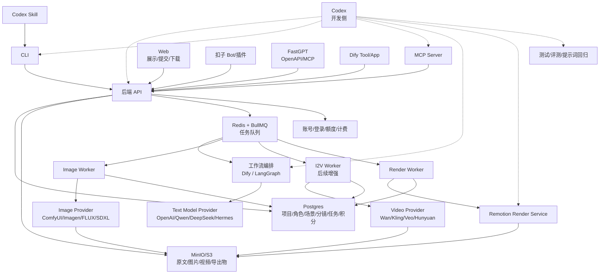

# AI-native 垂直能力服务平台 PRD

## 文档结论

本项目的核心不是“视频制作工具”，而是一个 AI-native 垂直能力服务平台：

> 把高价值垂直能力包装成可被智能体、CLI、MCP、工作流平台、Web 和企业 API 调用的服务单元，并通过账号、额度、任务队列、资源包和渠道发布体系完成商业化。

视频/漫剧前期制作只是第一个验证场景。第一阶段选择它，是因为这个场景有明确输入、明确产出、明确付费对象和清晰的前后生产链路。

首个服务单元是 `story_to_pack`：

```text
小说/剧本输入
-> 文本分析
-> 剧本/分镜结构
-> 角色图/场景图/镜头关键帧
-> 资产库
-> 分镜表/素材包/粗剪视频导出
```

图生视频、真人剧、自由画布、剧本市场、全网数据平台都不进入 MVP 主路径。

产品形态不是传统“用户必须进入网站后台操作”的 SaaS，而是：

```text
用户自己的智能体 / CLI / Web
-> 登录账号
-> 调用后端生产服务
-> 后端完成文本拆解、资产生成、粗剪导出
-> 返回标准资源包
```

Skill、MCP、CLI、Web、扣子、Dify、FastGPT 和开放 API 都是发布与调用渠道。后端生产能力、账号额度、任务系统和标准资源包才是产品核心。

## 背景与参考

本 PRD 基于两个公开参考站整理：

- 灵境 AI 创作页：`https://animeworkbench.lingjingai.cn/platform/creation`
- 网文大数据首页与公开二级页：`https://wangwendashuju.com/home`

观察边界：

- 灵境 AI 登录前可见的信息包括：视频创作、剧本创作、灵感选题、资产管理、项目管理、数据概览、素材创作等入口；点击核心创作能力后会触发登录，因此登录后的编辑器细节未验证。
- 网文大数据公开可见的信息包括：首页搜索、智能问数、拆文拉片示例、剧本市场、剧本详情评估报告等；内部数据源、算法和完整工作流未验证。
- 本 PRD 不是复刻竞品界面，而是抽象出可落地的视频创作产品需求。

## 商业判断

### 市场状态

AI 工具正在从“单一网站产品”转向“可被智能体调用的能力服务”。用户不一定愿意切换到新的后台，但愿意在自己的智能体、工作流平台、企业系统或命令行里调用一个能直接产出结果的能力。

通用 AI 视频生成工具已经拥挤。Veo、Runway、可灵、Pika、HunyuanVideo、Wan 等模型和平台都在提高视频质量、角色一致性、镜头控制和生成速度。单独包装一个“文生视频/图生视频”入口，很难形成长期壁垒。

短剧、漫剧、网文改编内容供给也在快速增加，低质量内容和同质化题材会继续挤压纯内容生产者。

但垂直生产工具还没有完全饱和。实际制作团队的痛点不是“生成一段视频”，而是：

- 如何把长文本稳定拆成可生产的剧本和分镜。
- 如何维护角色、场景、道具和风格的一致性。
- 如何把每个镜头的图片、视频、提示词、失败任务和成本统一管理。
- 如何把生成结果组织成可交付的分镜表、素材包或粗剪视频。

### 机会判断

本产品的机会不在通用模型能力，也不只在视频制作，而在“垂直能力服务化”：

```text
一个高价值任务
-> 标准输入输出
-> 后端生产服务
-> 多智能体渠道分发
-> 账号额度和资源包交付
```

视频/漫剧前期制作是第一个切入点。

首个切入点：

1. 网文/剧本转漫剧分镜。
2. 角色基准图、场景基准图、镜头关键帧生成。
3. 项目资产复用和生成任务管理。
4. 素材包、分镜表、粗剪视频导出。

第一批用户优先面向：

- 漫剧制作工作室。
- 短剧前期策划团队。
- 网文 IP 改编团队。
- MCN 或内容团队中的 AI 视频制作小组。

不建议第一阶段面向泛 C 端用户做大而全创作平台，也不建议把网站后台作为唯一入口。

### 商业验证指标

平台层面 MVP 应优先验证以下指标：

1. 一个服务单元能否通过 CLI、Skill、MCP 或第三方工作流平台稳定调用。
2. 用户是否愿意注册账号并消耗免费额度试跑。
3. 免费额度后是否愿意付费购买资源包或更高额度。
4. 渠道调用记录、成本、失败率和转化率是否可追踪。

`story_to_pack` 场景应优先验证以下指标：

1. 从 3000-10000 字文本生成第一版分镜的耗时。
2. 生成分镜中可直接进入人工编辑的比例。
3. 角色基准图复用后，后续镜头返工率是否下降。
4. 单个项目的图片/视频生成失败率和重试成本。
5. 用户是否愿意为“分镜表 + 资产包 + 粗剪导出”付费。
6. 团队是否把该工具用于真实项目，而不是只做演示。

## 产品定位

### 一句话定位

可被智能体调用的 AI 垂直能力服务平台，首个场景是小说/剧本到 AI 漫剧前期制作包。

### 不做什么

不是单一视频制作工具。
不是通用 AI 视频站，不直接对标 Runway、可灵、Veo。
不是完整网文数据平台，不直接对标网文大数据。
不是视频剪辑软件，不直接对标剪映、CapCut、Premiere。
不是自由画布工具，不直接对标 ComfyUI 或节点编排器。
不是只能通过网页使用的传统 SaaS。

### 做什么

把高价值能力服务化：

```text
垂直任务
-> 标准输入
-> 标准输出
-> 账号额度
-> 后端任务
-> 多渠道调用
-> 可交付资源包
```

首个场景先把漫剧前期生产链路做顺：

```text
文本理解
-> 剧本整理
-> 分镜拆解
-> 图片资产生成
-> 资产复用
-> 粗剪/素材导出
```

后续可以复用同一平台方法，继续扩展到爆款拆解、IP 评估、角色一致性包、分镜转工作流、提案包生成等能力。

## 问题陈述

AI 时代很多高价值功能不应该只被做成网站页面。用户已经在 Codex、Claude、扣子、Dify、FastGPT、CLI、企业系统等环境里工作，如果能力不能被这些智能体和工作流调用，就会增加使用阻力。

面向网文、短剧、漫剧创作的用户，当前从选题判断、文本分析、剧本改写、素材生成到视频产出之间链路较长，需要在多个工具之间来回切换。创作者很难在同一个工作流里完成“找到题材依据 -> 形成剧本结构 -> 拆成镜头/分镜 -> 生成素材 -> 组织成可交付作品”的闭环。

目标用户需要的不是另一个必须学习的新后台，而是一个能在自己现有智能体环境里调用的生产服务。首个场景里，这个服务既能承接小说/剧本等文本输入，也能围绕角色、剧情、分镜、素材、任务和成片版本进行持续管理。

## 目标

1. 建立一个账号、额度、任务、资源包和渠道调用体系。
2. 支持通过 CLI、Skill、MCP、Web、扣子、Dify、FastGPT 和开放 API 多渠道调用同一套后端能力。
3. 定义可复用的服务单元协议：输入、输出、验收、额度、重试、导出。
4. 第一阶段落地 `story_to_pack`，支持从小说、剧本或自由文本生成可编辑的分析结果、剧本结构和分镜结构。
5. 支持把 `story_to_pack` 项目拆成角色、场景、镜头、素材、任务和导出物。
6. 采用 Image-first 路线，优先保证角色图、场景图、关键帧的可控生成。
7. 支持资产复用、积分消耗、任务状态、失败重试和结果导出。

## 非目标

1. 第一阶段不做通用能力市场，不承诺覆盖所有 AI 任务。
2. 第一阶段不做完整网文大数据平台，不承诺覆盖全网榜单、作者分析、平台投流数据或实时行业趋势。
3. 第一阶段不做剧本交易市场、版权申领、编剧投稿和制作方收稿流程。
4. 第一阶段不做自由画布式多模态编排。
5. 第一阶段不承诺自动生成可直接发布的长片成片。
6. 第一阶段不承诺真人剧高保真生成、复杂口型同步、多人动作一致性和影视级后期。
7. 第一阶段不把图生视频作为主闭环必须能力；可以作为后续增强或灰度能力。
8. 不把参考站文案中的效率提升、成本降低等营销指标作为本产品承诺。

## 产品原则

1. 工作台优先展示可执行下一步，不把用户困在营销页。
2. AI 输出必须可编辑，不能把生成结果当成不可修改的终稿。
3. 长任务必须有状态反馈，失败必须能定位和重试。
4. 素材生成要围绕项目资产复用，减少重复输入同一角色和场景。
5. 图片资产是第一阶段的生产核心，视频生成是图片资产后的增强路径。
6. 数据分析只做创作辅助，不能替代用户的立项判断。
7. 模型能力必须可替换，不能把产品绑定到单一模型或单一供应商。
8. Skill、MCP、扣子、Dify、FastGPT 都是发布和调用渠道，不是业务事实来源。
9. CLI、Skill、MCP 和第三方工作流平台都不能内置供应商模型密钥。

## AI-native 服务化产品策略

### 核心判断

AI 时代的产品不一定先做完整网站后台。更适合的方式是把高价值能力包装成“可被智能体调用的服务单元”：

```text
垂直任务
-> 标准输入
-> 标准输出
-> 后端 API
-> 账号额度
-> CLI
-> Skill
-> MCP
-> 扣子/Dify/FastGPT 工具
-> Web 展示页
```

用户不一定进入我们的 UI。用户可以在 Codex、Claude、扣子、Dify、FastGPT、CLI、企业系统或自己的智能体环境里调用服务。我们负责稳定生产、计费、存储、打包和交付。

### 渠道变化

过去的软件产品主要是“网页渠道”，核心路径是：

```text
人
-> 打开网页
-> 学习 UI
-> 操作工具
-> 下载结果
```

AI-native 产品会增加大量“智能体渠道”，核心路径变成：

```text
人
-> 告诉智能体目标
-> 智能体调用 Skill / MCP / CLI / API / 扣子 / Dify / FastGPT
-> 后端服务生产结果
-> 智能体把结果交还给人
```

网页不会消失，但网页从唯一入口变成众多入口之一。

渠道分工：

| 渠道类型 | 面向对象 | 主要作用 |
|---|---|---|
| 网页渠道 | 人 | 建立信任、展示案例、注册、支付、提交试跑、下载结果 |
| 智能体渠道 | Agent | 发现能力、理解参数、调用工具、检查产出、处理失败 |
| 工作流渠道 | Dify/FastGPT/扣子等平台 | 把能力嵌入用户已有流程 |
| 系统渠道 | 企业系统/API | 批量调用、私有化集成、自动化生产 |
| CLI 渠道 | 技术用户/内部交付团队 | 稳定执行、批处理、调试和交付 |

### 服务单元定义

每个可产品化能力都需要定义：

1. 用户输入什么。
2. 服务产出什么。
3. 产出物能拿去做什么。
4. 消耗多少额度。
5. 如何验收质量。
6. 失败如何重试。
7. 可以通过哪些渠道调用。

### 第一批服务单元

```text
story_to_pack
script_to_storyboard
character_to_reference_pack
shot_to_keyframe
keyframes_to_rough_cut
hot_content_breakdown
ip_adaptation_eval
proposal_pack
workflow_pack
```

第一阶段重点做 `story_to_pack`：

```text
输入：
- 小说/剧本文本
- 画风
- 目标镜头数
- 输出类型

输出：
- storyboard.md
- characters.json
- scenes.json
- shots.csv / shots.json
- prompts.json
- assets/
- rough-cut.mp4
- package.zip
```

后续可扩展服务单元：

| 服务单元 | 输入 | 输出 | 用户 |
|---|---|---|---|
| `hot_content_breakdown` | 爆款视频/剧本/链接 | 节奏表、爽点、钩子、结构拆解 | 编剧、策划、MCN |
| `ip_adaptation_eval` | 小说/IP 片段 | 改编潜力、风险、受众、成本估计 | IP 方、制片 |
| `character_to_reference_pack` | 角色描述/参考图 | 角色卡、多角度图、prompt | AI 绘图师、漫剧团队 |
| `workflow_pack` | 分镜表/资产 | ComfyUI workflow、批量 prompt、任务清单 | AI 操作员 |
| `proposal_pack` | 故事、角色图、分镜 | Markdown/PPT 提案、粗剪 Demo | 商务、IP 方 |

### 发布渠道矩阵

| 渠道 | 类型 | 作用 | 第一阶段优先级 |
|---|---|---|---|
| 后端 API | 系统渠道 | 核心生产服务，负责账号、额度、任务、资产和打包 | P0 |
| CLI | CLI 渠道 | 稳定执行入口，适合内部交付、技术型客户和批处理 | P0 |
| Codex Skill | 智能体渠道 | 让 Codex 用户和内部智能体知道如何调用 CLI/API 并验收结果 | P1 |
| MCP Server | 智能体渠道 | 跨智能体调用协议，后续接 ChatGPT、Claude、Cursor、VS Code 等 | P1 |
| Dify Tool / Workflow | 工作流渠道 | 文本拆解工作流或外部工具入口 | P1 |
| FastGPT OpenAPI / MCP | 工作流渠道 | 企业私有化、知识库和工作流入口 | P2 |
| 扣子 Bot / 插件 | 工作流渠道 | 国内普通用户 Bot 入口和演示获客入口 | P2 |
| 极简 Web | 网页渠道 | 案例展示、注册、提交试跑、下载结果 | P2 |
| 企业开放 API | 系统渠道 | 给制作公司、平台方接入内部系统 | P3 |

### 渠道边界

后端 API 是产品核心。所有渠道都应调用后端 API，而不是直接管理模型密钥、任务状态、项目资产或扣费逻辑。

推荐链路：

```text
Codex Skill / MCP / CLI / 扣子 / Dify / FastGPT / Web
-> 后端 API
-> 鉴权和额度
-> 任务队列
-> Dify/LangGraph/模型/ComfyUI/Remotion
-> 标准资源包
```

不推荐链路：

```text
扣子 -> Dify -> FastGPT -> ComfyUI -> Remotion -> 文件
```

原因是状态、额度、失败重试、资产回写和成本核算都会分散，难以产品化。

## 解决方案

建设一个“AI-native 垂直能力服务平台”。第一阶段先落地“AI 漫剧前期制作服务”。用户可以从 CLI、Skill、MCP、Web 或第三方智能体平台发起任务，后端围绕项目推进：

1. 项目创建：输入项目名、文本来源、目标形式、画面风格。
2. 文本分析：上传小说、剧本或粘贴文本，生成核心标签、情绪冲突、角色档案、故事弧线和世界观设定。
3. 剧本整理：把输入内容转成可编辑剧本结构，支持按集、场景、段落拆分。
4. 分镜生成：基于剧本生成镜头列表，包括画面描述、角色、场景、对白、时长、图片提示词和动作提示词。
5. 图片资产生成：围绕角色、场景、道具和镜头生成基准图、概念图、关键帧。
6. 资产管理：保存资产来源、引用关系、参考图、提示词版本和生成记录。
7. 粗剪导出：把镜头关键帧、字幕、旁白和简单运镜合成为可预览粗剪，或导出分镜表和素材包。

## Image-first 路线

第一阶段推荐路线：

```text
文本 -> 分镜 -> 角色图/场景图/关键帧 -> 粗剪导出
```

而不是：

```text
文本 -> 直接生成视频
```

原因：

1. 图片生成成本低于视频生成，更适合高频重试。
2. 用户能先确认角色、场景、画风，再进入更贵的视频步骤。
3. 角色基准图和场景基准图可以沉淀为项目资产，降低后续镜头漂移。
4. 每个镜头先有关键帧，更适合人工审查、修改和交付。
5. 动态漫粗剪可以先用关键帧、字幕、旁白和简单运镜完成，不必依赖高质量图生视频。

图生视频增强路线：

```text
镜头关键帧
-> 图生视频
-> 单镜头视频片段
-> Remotion 合成
```

## 用户角色

1. 内容策划：关注题材、受众、爆点、风险和立项依据。
2. 编剧：关注文本分析、剧本格式、角色关系、情绪节奏和分集结构。
3. AI 视频创作者：关注分镜、素材生成、镜头一致性和导出。
4. 制片/团队负责人：关注项目进度、成本、成员协作、资产复用和交付结果。
5. 管理员：关注用户、积分、模型调用、数据概览和异常任务。

## 核心入口

### MVP 入口

1. 漫剧创作：面向小说/剧本转 AI 动漫、动态漫、漫剧分镜。
2. 素材创作：面向角色图、场景图、镜头关键帧、局部图像编辑。
3. 项目管理：面向项目列表、资产、任务、导出物和积分消耗。

### 后续入口

1. 真人剧创作：后续增强，不进入 MVP。
2. 自由画布：后续探索，不进入 MVP。
3. AI 写剧本：后续增强，不进入 MVP。
4. 剧本市场：后续商业合作能力，不进入 MVP。
5. 行业数据平台：后续立项辅助能力，不进入 MVP。

## MVP 范围

第一期聚焦“小说/剧本到可复用图片资产和粗剪导出”的闭环。

### 1. 项目创建

用户可以创建一个创作项目，并选择：

- 项目类型：漫剧创作、素材创作。
- 输入方式：粘贴文本、上传 `.txt`、上传 `.md`。
- 可选输入方式：上传 `.docx`，如果文档解析能力已经接入。
- 目标形式：分镜方案、动态漫粗剪、素材包。
- 画面风格：用户选择预设风格或输入自定义风格说明。

验收标准：

- 用户能在 1 个入口完成项目创建。
- 创建后能看到项目首页、当前阶段、待处理任务和下一步动作。
- 不同输入方式有明确校验、错误提示和重新上传路径。

### 2. 文本分析

系统读取小说/剧本后，生成结构化结果：

- 核心标签：频道、题材、世界观、情感关系、角色特征、金手指、钩子、氛围。
- 情绪与冲突：爽点、虐点、冲突类型、对应章节或段落。
- 角色档案：姓名、身份、性格、关系、外观描述、关键动机。
- 故事弧线：起点、转折、高潮、结局、覆盖章节。
- 世界观设定：时代、地点、组织、规则、关键道具。
- 一句话概括：可供立项和项目列表展示的短摘要。

验收标准：

- 用户能查看每类分析结果，并手动编辑。
- 编辑后的分析结果会进入后续剧本、分镜和素材生成。
- 分析失败时保留原始输入，并允许重试。
- 模型输出必须通过结构化校验后才能写入业务数据。

### 3. 剧本整理

系统把文本整理为可编辑剧本：

- 支持按集、场景、段落拆分。
- 每个场景包含地点、时间、出场角色、剧情摘要、对白、动作描述。
- 支持用户合并、拆分、重排场景。
- 支持从分析结果补全角色和世界观信息。

验收标准：

- 用户能从原始文本生成第一版剧本结构。
- 用户能编辑任意场景，并保存版本。
- 用户能选择部分场景进入分镜生成，而不是必须处理全文。

### 4. 分镜生成

系统基于剧本生成镜头列表：

- 镜头编号。
- 所属集/场景。
- 画面描述。
- 出场角色。
- 场景/道具。
- 对白或旁白。
- 情绪和镜头意图。
- 建议时长。
- 图片生成提示词。
- 动作提示词。
- 可选视频生成提示词。

验收标准：

- 用户能从一个场景生成多个镜头。
- 用户能编辑镜头字段。
- 用户能选择单个镜头生成关键帧。
- 分镜列表能清楚展示生成状态：未生成、生成中、成功、失败、已重试。

### 5. 图片素材创作

MVP 支持以下素材能力：

- 角色形象图生成。
- 场景概念图生成。
- 道具图生成。
- 镜头关键帧生成。
- 图像编辑：基于已有图片进行局部修改或风格调整。

验收标准：

- 用户能从角色、场景或镜头直接发起生成。
- 生成结果自动归档到项目资产库。
- 同一角色再次生成时能复用角色设定和角色基准图。
- 用户能标记某张图为角色、场景或镜头参考图。
- 不满意结果可以重试，重试不会覆盖已保存资产。

### 6. 粗剪与导出

MVP 支持基于关键帧的粗剪和导出：

- 分镜表导出。
- 图片素材包导出。
- 项目 JSON 导出。
- 基于关键帧、字幕、旁白和简单运镜的粗剪 MP4。

验收标准：

- 用户能选择一组镜头生成预览。
- 粗剪能按镜头顺序展示关键帧、对白/旁白和基础时长。
- 导出物能回写到项目资产库。
- 导出失败时保留任务记录，并支持重试。

### 7. 资产管理

资产按项目组织：

- 角色资产。
- 场景资产。
- 道具资产。
- 镜头关键帧。
- 视频片段，后续增强。
- 音频和旁白，后续增强。
- 提示词版本。
- 导出文件。

验收标准：

- 用户能按资产类型筛选。
- 用户能查看资产来源：由哪个角色、场景、镜头或任务生成。
- 用户能把资产设为后续生成参考。
- 删除资产前需要提示其是否被镜头引用。

### 8. 项目管理

项目列表展示：

- 项目名称。
- 类型。
- 最近编辑时间。
- 当前阶段。
- 完成进度。
- 生成任务状态。
- 积分消耗。
- 导出状态。

验收标准：

- 用户能搜索、筛选、打开、复制和归档项目。
- 用户能看到项目内失败任务并重试。
- 管理员能看到项目级数据概览。

### 9. 积分与任务状态

所有生成任务需要展示：

- 预计消耗。
- 实际消耗。
- 排队状态。
- 生成进度。
- 失败原因。
- 重试入口。

验收标准：

- 用户在发起高成本生成前能看到积分消耗提示。
- 积分不足时不吞任务，直接提示充值或降级生成方案。
- 失败任务不会重复扣费，除非用户明确重新发起。

## 技术架构

### 架构原则

1. 平台后端是主系统，Dify、ComfyUI、Remotion、模型服务和第三方智能体平台都只是能力或入口。
2. Postgres 是唯一业务事实来源。
3. 对象存储保存原文、图片、视频、导出文件。
4. 所有高耗时生成任务必须进入队列。
5. 模型调用必须通过 Provider 抽象，不把业务逻辑绑定到单一模型。
6. Codex、扣子、Dify、FastGPT 等智能体入口只调用后端 API，不直接拥有业务状态。
7. Codex 用于开发侧和 Skill 发布侧，不作为线上用户请求的业务运行时。

### 推荐 MVP 技术栈

```text
Web：Next.js，第一阶段只做展示、注册、提交试跑和下载结果
CLI：Node.js / Python，封装登录、创建任务、查询状态、导出资源包
Skill：Codex Skill，封装 CLI/API 调用说明和验收流程
MCP：Remote MCP Server，暴露标准工具给智能体
后端：NestJS / Fastify / Next.js API
数据库：Postgres
对象存储：MinIO，后续可换 S3/OSS
队列：Redis + BullMQ
文本工作流：Dify，后续可迁移 LangGraph
文本模型：OpenAI / Qwen / DeepSeek / Hermes，通过 Provider 抽象接入
图片生成：ComfyUI 或第三方 Image API
图生视频：后续接 Wan I2V / HunyuanVideo I2V / Kling / Veo
视频合成：Remotion
第三方入口：Dify Tool、FastGPT OpenAPI/MCP、扣子插件
```

### 总体架构图



### 组件边界

#### 业务后端

负责：

- 用户、项目、权限、积分。
- 文本、角色、场景、分镜、资产、任务。
- 任务创建、状态流转、失败重试。
- Provider 调度和结果回写。
- 标准资源包打包和下载链接。
- 统一对外 API，供 CLI、MCP、Skill、Web、扣子、Dify、FastGPT 调用。
- 服务单元注册、输入输出协议、渠道调用记录和成本核算。

不负责：

- 直接承载模型推理。
- 保存模型工具自己的临时状态作为业务事实。

#### CLI

CLI 是第一阶段最稳定的执行入口，适合内部交付、技术型客户和批量处理。

负责：

- 登录和保存用户级 token。
- 上传文本。
- 创建资源包任务。
- 查询任务状态。
- 下载和导出资源包。
- 在本地检查资源包完整性。

不负责：

- 内置供应商模型 token。
- 直接调用模型供应商。
- 保存服务端业务事实。

建议命令：

```bash
lingjing login
lingjing create ./story.txt --style anime --max-shots 30
lingjing status <job_id>
lingjing export <project_id> --format zip
lingjing check <package.zip>
```

#### Skill / MCP

Skill 和 MCP 是智能体分发渠道。

Skill 负责告诉智能体：

- 服务能做什么。
- 需要什么输入。
- 如何登录。
- 如何调用 CLI 或 API。
- 如何检查资源包是否完整。
- 失败时如何重试。

MCP 负责把服务暴露成标准工具：

```text
create_storyboard_pack
get_job_status
export_package
check_package
```

不负责：

- 管理模型密钥。
- 管理额度和扣费。
- 保存项目事实数据。

#### 扣子 / Dify / FastGPT

扣子、Dify、FastGPT 都可以作为入口或编排渠道。

推荐方式：

```text
扣子 / Dify / FastGPT
-> 调后端 API
-> 后端鉴权、扣额度、建任务
-> 后端返回 job_id 或下载链接
```

各自定位：

- 扣子：适合国内 Bot 演示、获客和普通用户入口。
- Dify：适合文本拆解、分镜生成等工作流，也可作为外部 Tool 调后端。
- FastGPT：适合私有化、企业知识库、飞书/企微/钉钉等企业场景。

不建议让它们串联成一条长链路，也不建议让它们直接管理资源包生产的业务事实。

#### Dify / LangGraph

负责：

- 文本分析。
- 角色提取。
- 剧本整理。
- 分镜生成。
- 生成结构化 JSON。

不负责：

- 保存项目事实数据。
- 管理资产库。
- 管理积分、权限和导出物。

第一阶段可用 Dify 快速落地。后续如果状态控制、人工干预、评测和版本管理复杂，可以迁移到 LangGraph 或自研工作流层。

#### Hermes / 其他文本模型

Hermes 适合作为 Text Model Provider 的候选，而不是完整业务系统。

可承担：

- 小说拆解。
- 角色卡生成。
- 场景卡生成。
- 分镜生成。
- 图片提示词和动作提示词生成。
- 结果质检。

注意事项：

- 中文网文、短剧语境需要和 Qwen、DeepSeek、OpenAI 模型做样本评测。
- 所有输出必须经过 JSON Schema 校验。
- 私有化部署能降低成本和提升数据控制，但会增加推理、运维和评测成本。

#### ComfyUI / Image Provider

ComfyUI 适合作为图片和视频生成工作流执行器，不应该直接作为用户前台。

负责：

- 角色图生成。
- 场景图生成。
- 道具图生成。
- 镜头关键帧生成。
- 图像编辑和风格调整。

不负责：

- 项目管理。
- 资产管理。
- 积分管理。
- 用户权限。

#### Remotion

负责：

- 基于镜头顺序生成预览。
- 把关键帧、字幕、旁白、简单运镜合成粗剪 MP4。
- 导出项目视频片段。

不负责：

- 做完整剪辑器。
- 管理项目资产。
- 生成 AI 图片或 AI 视频。

#### Codex

Codex 适合作为开发侧工具，用来提高研发和维护效率。

适合做：

- 根据 PRD 生成 schema、API、测试和页面。
- 生成 Dify/LangGraph 工作流模板。
- 生成 ComfyUI workflow adapter。
- 生成 Remotion 模板。
- 维护提示词评测集和回归测试。

不建议做：

- 线上用户每次点击生成时临时调用 Codex 跑流程。
- 让 Codex 直接管理生产数据、积分或用户权限。

## 核心数据模型

### 建议主表

```text
users
api_tokens
projects
source_documents
analysis_results
characters
scenes
shots
assets
generation_tasks
render_jobs
credit_records
packages
channel_invocations
```

### User

```text
id
name
email
phone
status
free_quota
created_at
updated_at
```

### ApiToken

```text
id
user_id
name
token_hash
channel
scopes
last_used_at
expires_at
created_at
```

### Project

```text
id
owner_id
name
type
style_preset
custom_style
current_stage
status
created_at
updated_at
```

### SourceDocument

```text
id
project_id
file_name
file_type
storage_url
raw_text
parse_status
created_at
```

### Character

```text
id
project_id
name
identity
personality
relationship_notes
appearance
motivation
reference_asset_id
created_at
updated_at
```

### Scene

```text
id
project_id
episode_no
order_no
location
time_of_day
summary
dialogue
action_description
character_ids
created_at
updated_at
```

### Shot

```text
id
project_id
scene_id
order_no
visual_description
dialogue
narration
emotion
duration_seconds
image_prompt
motion_prompt
video_prompt
status
created_at
updated_at
```

### Asset

```text
id
project_id
type
source_type
source_id
storage_url
thumbnail_url
prompt
provider
model
is_reference
created_at
```

资产类型：

```text
character_image
scene_image
prop_image
shot_keyframe
video_clip
audio
storyboard_export
asset_package
rough_cut_video
```

### GenerationTask

```text
id
project_id
task_type
source_type
source_id
provider
model
input_payload
status
estimated_credits
actual_credits
error_code
error_message
retry_of_task_id
created_at
updated_at
```

### Package

```text
id
project_id
type
storage_url
manifest
status
created_at
```

包类型：

```text
storyboard_pack
asset_package
rough_cut_package
project_export
```

### ChannelInvocation

```text
id
user_id
project_id
channel
tool_name
request_payload
response_payload
status
created_at
```

渠道类型：

```text
cli
codex_skill
mcp
web
coze
dify
fastgpt
api
```

## 信息架构

建议主导航：

1. 创作
2. 项目
3. 资产
4. 任务
5. 数据概览
6. 用户管理

创作首页建议分区：

1. 漫剧创作
   - 小说/剧本转分镜
   - 分镜转关键帧
   - 粗剪导出
2. 素材创作
   - 角色图
   - 场景图
   - 道具图
   - 镜头关键帧
3. 灵感选题，后续增强
   - 爆款拆解
   - 拆书/拉片
   - 行业数据

## 关键流程

### 流程一：小说到漫剧分镜

1. 用户创建“漫剧创作”项目。
2. 用户上传小说或粘贴文本。
3. 系统生成文本分析结果。
4. 用户确认角色、世界观和剧情摘要。
5. 系统生成剧本结构。
6. 用户选择一段场景进入分镜。
7. 系统生成镜头列表和提示词。
8. 用户生成角色基准图和场景图。
9. 用户逐镜头生成关键帧。
10. 用户导出分镜表、素材包或粗剪视频。

### 流程二：剧本到素材生成

1. 用户创建“素材创作”项目。
2. 用户输入角色、场景或镜头描述。
3. 系统生成图片资产。
4. 用户对结果进行编辑、重试或设为参考。
5. 资产进入项目资产库。

### 流程三：关键帧到粗剪

1. 用户选择一组镜头。
2. 系统读取镜头顺序、关键帧、对白/旁白和时长。
3. Remotion 生成预览。
4. 用户调整镜头时长或字幕。
5. 系统导出 MP4 或素材包。

### 流程四：关键帧到图生视频，后续增强

1. 用户选择一个镜头关键帧。
2. 用户补充动作提示词。
3. 系统调用图生视频模型。
4. 单镜头视频片段进入资产库。
5. 用户在粗剪中替换静态关键帧。

## 权限要求

- 个人用户只能访问自己的项目和资产。
- 团队管理员可以查看团队项目、成员和消耗概览。
- 项目成员权限至少区分：查看、编辑、管理。
- 公开分享和外链下载不进入 MVP，后续单独评审。

## 用户故事

1. 作为内容策划，我想输入一个故事创意并看到题材标签，所以我能判断它是否值得继续开发。
2. 作为内容策划，我想查看类似爆款的标签、冲突和爽点，所以我能优化选题方向。
3. 作为编剧，我想上传小说文本并自动提取角色档案，所以我不用手动整理人物关系。
4. 作为编剧，我想看到情绪与冲突分布，所以我能判断剧情节奏是否足够密集。
5. 作为编剧，我想把小说转成剧本格式，所以我能继续按场景修改。
6. 作为编剧，我想手动编辑系统生成的剧本结构，所以我能保留自己的创作判断。
7. 作为视频创作者，我想从某个场景生成分镜，所以我能快速得到镜头方案。
8. 作为视频创作者，我想编辑镜头描述和提示词，所以我能控制画面结果。
9. 作为视频创作者，我想先生成角色基准图，所以后续镜头能保持角色一致。
10. 作为视频创作者，我想把满意的图片设为参考，所以后续生成能沿用风格。
11. 作为视频创作者，我想单独重试失败镜头，所以我不用重新生成整集。
12. 作为视频创作者，我想查看每个镜头的生成状态，所以我知道下一步该处理哪里。
13. 作为团队负责人，我想查看项目进度和积分消耗，所以我能控制成本。
14. 作为团队负责人，我想复制一个项目作为新版本，所以我能尝试不同风格方案。
15. 作为管理员，我想查看生成失败率和失败原因，所以我能定位模型或队列问题。
16. 作为管理员，我想管理用户和项目归属，所以团队资产不会混乱。

## 验收指标

### 功能验收

1. 用户能从文本创建项目，并生成可编辑的分析结果。
2. 用户能从分析结果生成剧本结构。
3. 用户能从剧本场景生成分镜列表。
4. 用户能从分镜生成至少一种图片资产。
5. 用户能把角色图、场景图或关键帧设为参考资产。
6. 用户能查看并管理项目资产。
7. 用户能看到生成任务状态和积分消耗。
8. 用户能重试失败任务。
9. 用户能导出分镜表、素材包或粗剪视频。

### 质量验收

1. 核心流程不依赖人工后台干预。
2. 生成失败不会导致项目数据丢失。
3. 编辑后的角色、场景和剧本能被后续步骤使用。
4. 同一项目内资产引用关系可追踪。
5. MVP 不出现剧本市场、版权交易、全网数据平台等范围外入口作为核心路径。
6. 模型输出不会绕过结构化校验直接写入业务表。

### 商业验收

1. 至少 3 个真实样本文本能完成“文本 -> 分镜 -> 关键帧 -> 导出”闭环。
2. 至少 1 个目标团队愿意用自己的真实素材试跑。
3. 用户愿意为素材包、分镜表或粗剪结果付费，或明确提出采购条件。
4. 单个项目的任务成本、失败率和人工返工点可以被记录和复盘。

## 测试决策

测试只验证外部行为，不绑定具体模型输出的逐字内容。

建议测试范围：

1. 项目创建：不同输入方式、文件格式校验、错误提示。
2. 文本分析：任务创建、状态流转、结果保存、用户编辑。
3. 结构化校验：模型输出缺字段、错类型、非法枚举时不能直接入库。
4. 剧本整理：场景增删改、版本保存、部分场景进入分镜。
5. 分镜生成：镜头列表生成、字段编辑、状态展示。
6. 图片素材生成：任务提交、积分预估、成功回写、失败重试。
7. 资产管理：筛选、引用关系、设为参考、删除保护。
8. 粗剪导出：任务提交、导出文件回写、失败重试。
9. 权限：个人项目隔离、团队成员访问控制。

不建议测试：

- 模型输出的具体措辞。
- 页面内部实现细节。
- 第三方模型的稳定性。
- ComfyUI、Dify、Remotion 内部实现。

## 里程碑建议

### M0：样板资源包

- 选择 2-3 个小说/剧本样本。
- 人工辅助跑通角色、场景、分镜、关键帧和粗剪。
- 形成可展示的 `package.zip`。
- 明确资源包目录结构和验收清单。

### M1：后端 API 与账号额度

- 用户账号。
- 用户级 API token。
- 免费额度。
- 项目创建。
- 文本上传。
- 任务创建。
- 状态查询。
- 资源包下载。

### M2：CLI 执行入口

- `lingjing login`。
- `lingjing create`。
- `lingjing status`。
- `lingjing export`。
- `lingjing check`。
- 本地资源包完整性检查。

### M3：文本拆解与分镜服务

- 文本解析。
- Dify/LangGraph 工作流接入。
- 角色提取。
- 场景提取。
- 小说转剧本。
- 场景转分镜。
- 图片提示词和动作提示词生成。
- JSON Schema 校验。

### M4：图片生成与资产库

- 角色图生成。
- 场景图生成。
- 道具图生成。
- 镜头关键帧生成。
- 参考图设置。
- 资产归档和引用关系。

### M5：粗剪与资源包导出

- 分镜表导出。
- 素材包导出。
- 项目 JSON 导出。
- Remotion 粗剪预览。
- MP4 导出。
- `package.zip` 打包。

### M6：Skill / MCP / 第三方入口

- Codex Skill。
- Remote MCP Server。
- Dify Tool 接入。
- FastGPT OpenAPI/MCP 接入。
- 扣子插件/Bot 接入。
- 极简 Web 展示和提交试跑。

### M7：图生视频灰度

- 单镜头关键帧转视频。
- 视频片段入库。
- 粗剪中替换静态关键帧。
- 记录成本、失败率和用户真实使用频次。

## 后续增强

### 新服务单元孵化

后续可基于同一套后端能力和发布渠道，扩展更多垂直服务单元：

- 爆款内容拆解。
- 网文/IP 改编评估。
- 角色一致性参考包。
- 分镜转 ComfyUI 工作流。
- 商务提案包生成。
- 账号内容批量选题。
- 企业内部知识库到视频脚本。

每个新服务单元都必须先定义标准输入、标准输出、验收方式、额度消耗和目标渠道，不能只做成一次性脚本。

### 数据驱动选题

后续可提供：

- 作品/作者搜索。
- 热门题材与标签分析。
- 爆款作品拆解。
- 受众画像。
- 改编潜力评分。
- 政策风险、市场饱和度、制作成本风险提示。
- “智能问数”：用户用自然语言询问选题和对标问题，系统返回数据报告。

这些能力适合作为立项辅助，不应阻塞 MVP 的视频创作闭环。

### 剧本评估与市场

后续可提供：

- 剧本综合评级。
- 六维评分：世界观、人设、钩子、金手指、关系、氛围。
- 改编潜力：短剧、动态漫、漫画、有声、游戏、影视。
- 受众画像与风险评估。
- 剧本投稿、收稿、申领和版权流程。

这些能力涉及内容运营、版权和商业合作，不进入 MVP。

### 团队协作

后续可提供：

- 项目成员。
- 角色权限。
- 评论与批注。
- 任务分派。
- 审核流。
- 企业培训和模板沉淀。

### 高级视频能力

后续可提供：

- 图生视频批量生成。
- 视频延长。
- 多角色动作一致性。
- 口型同步。
- 配音和音效。
- 更完整的剪辑时间线。

## 待验证问题

1. 平台第一阶段是否只验证 `story_to_pack`，还是同时做一个更轻量的 `character_to_reference_pack`？
2. 首批客户更看重分镜表、图片素材包，还是粗剪视频？
3. 当前可用的图片模型是否支持稳定参考图、角色一致性和局部编辑？
4. 图生视频模型的成本和失败率是否适合进入第二阶段？
5. `.docx` 上传是否必须首期支持，还是先做纯文本和 Markdown？
6. 是否已有用户、积分、项目和资产系统可复用？
7. 第一版是否需要团队协作权限，还是先做个人工作台？
8. 是否有内部样本文本和真实项目可用于评测？
9. 第一批发布渠道优先选 Codex Skill、Dify、FastGPT 还是扣子？
10. 免费额度应该按字数、镜头数、图片数还是资源包次数限制？
11. 第二个服务单元应该选择视频链路内能力，还是选择更通用的提案包/拆解包能力？

## 参考资料

- 灵境 AI 创作页：`https://animeworkbench.lingjingai.cn/platform/creation`
- 网文大数据：`https://wangwendashuju.com/home`
- ComfyUI：`https://github.com/comfy-org/comfyui`
- Dify：`https://github.com/langgenius/dify`
- LangGraph：`https://github.com/langchain-ai/langgraph`
- Remotion：`https://github.com/remotion-dev/remotion`
- Wan2.2：`https://github.com/Wan-Video/Wan2.2`
- HunyuanVideo：`https://github.com/Tencent-Hunyuan/HunyuanVideo`
- Nous Hermes：`https://huggingface.co/NousResearch`
- FastGPT：`https://github.com/labring/FastGPT`
- Coze：`https://www.coze.com`
- Model Context Protocol：`https://modelcontextprotocol.io`
- Codex Skills：`https://developers.openai.com/codex/skills`
